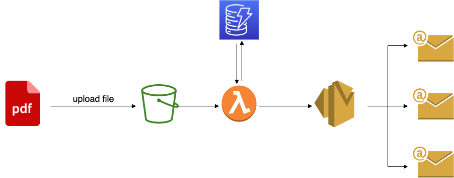

# terraform-aws-mass-emailing
This project aims to send mass e-mails to a list of users. To develop a cost-effective mass-mailing and serverless platform, you can combine AWS Lambda with Simple Email Service (SES), S3 and DynamoDB. As soon as a PDF file is uploaded, it will trigger an S3 event. A Lambda function will be invoked that will send the pdf as an email attachment to all the users stored in DynamoDB.



--------------------------------------------
## Pre-requisites

Only using AWS services, an AWS account is required.

You will need to install [Terraform](https://learn.hashicorp.com/tutorials/terraform/install-cli).

**Other requirements**
- Node
- Git
- TypeScript

---------------------------------------------------------
## Lambda Node project setup
Clone the repo and install the dependencies.

git clone https://github.com/inktense/terraform-aws-mass-emailing.git.
```
cd email-lambda
```
```
npm install
npm build
```
----------------------------------------------------------------
## Deploying to the cloud
If you want to use Terraform with an AWS profile use the following command:

```
export AWS_PROFILE= <profile>
```
Otherwise folow one of these [instructions](https://registry.terraform.io/providers/hashicorp/aws/latest/docs).

Create a new `var.tfvars` file and add the email address that you want to use as the SES identity.
```
email = "example@test.com"
```

For deployment follow the next steps:
```
cd terraform 

tf init 
tf plan --var-file=var.tfvars
tf apply --var-file=var.tfvars
```
Terraform will create an SES email identity but you will need to verify it.

**To verify an email address identity**

- Check the inbox of the email address used to create your identity and look for an email from no-reply-aws@amazon.com.

- Open the email and click the link to complete the verification process for the email address. After it's complete, the Identity status updates to Verified.

**The DynamoDB table create will be empty.** For the purpose of this project I have added manually a couple of users to test. The objects need to have the following structure:

```typescript
{
 "id": string,
 "createdAt": string,
 "email": string
}
```

In order to tear down the entire infrastructure use:
```
tf destroy --var-file=var.tfvars
```

--------------------------------
## Testing functionality

Open the AWS console. Search for S3 and upload a PDF file into the `aws-mass-emailing-attachment-bucket`. This should trigger the Lambda and users added into DynamoDB should expect an email containing that attachment.
